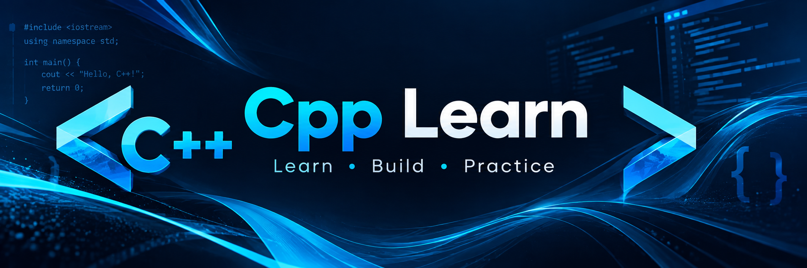

<p align="center">
  
</p>

<h1 align="center">Cpp Learn</h1>

<p align="center">
  A practical place to learn C++ one concept and one program at a time.
</p>

<p align="center">
  <a href="#getting-started">Get started</a> ·
  <a href="#contributing">Contribute</a>
</p>

## About

**Cpp Learn** is a growing collection of C++ notes, examples, and exercises. Follow the roadmap in order if you are new to the language, or jump to a topic you want to practice. Each example should be small enough to read, run, and change yourself.

> This repository is being built. The links will be added as lessons are published.

## Getting started

Install a C++ compiler with C++17 support, such as GCC, Clang, or MSVC. Check your installation:

```bash
g++ --version
```

To compile an example once it has been added:

```bash
g++ -std=c++17 -Wall -Wextra -pedantic path/to/example.cpp -o example
./example
```

On Windows PowerShell, run the executable with `./example.exe` or `.\example.exe`, depending on your shell. If using MSVC, open a Developer Command Prompt and compile with `cl /std:c++17 /W4 path\to\example.cpp`.


## Contributing

Suggestions, fixes, and new beginner-friendly examples are welcome. Open an issue describing the idea or submit a pull request. For code examples, include a short explanation and the command needed to compile them.

## License
